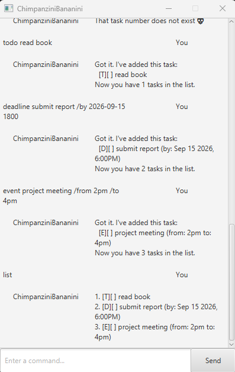

# ChimpanziniBananini User Guide

ChimpanziniBananini helps you keep track of to-dos, deadlines, and events. Add tasks, mark them done, and check what's coming up.

## Quick Start

1. Install Java 25. Place the application JAR in a folder where you can save files.
2. Open a terminal in that folder and run `java -jar FILE.jar`, replacing `FILE.jar` with the application's JAR filename.
3. Type a command in the input box and press **Enter** or click **Send**. Try `todo read book`, then `list`.

Task changes are saved automatically after successful adds, marks, and deletions. Launch from the same folder next time to load your saved tasks.

## Commands

Use lowercase command names. Replace UPPERCASE placeholders with your own values; descriptions can contain spaces. Include spaces around `/by`, `/from`, and `/to` as shown.

| Command | What it does | Format | Example |
| --- | --- | --- | --- |
| `todo` | Adds a task without a date. | `todo DESCRIPTION` | `todo read book` |
| `deadline` | Adds a task with a due date and optional time. | `deadline DESCRIPTION /by DATE` | `deadline return book /by 20/9/2026 1800` |
| `event` | Adds an event with start and end details. | `event DESCRIPTION /from START /to END` | `event meeting /from 2pm /to 4pm` |
| `list` | Shows all tasks, including completed ones. | `list` | `list` |
| `mark` | Marks a task as done. | `mark NUMBER` | `mark 1` |
| `delete` | Removes a task. | `delete NUMBER` | `delete 1` |
| `find` | Finds descriptions containing the given text; matching is case-sensitive. | `find KEYWORD` | `find book` |
| `reminders` | Shows incomplete deadlines due from now through seven days later, earliest first. | `reminders` | `reminders` |
| `bye` | Displays a farewell. | `bye` | `bye` |

For `mark` and `delete`, use the task number from the latest full `list`, starting at 1. Search and reminder results have their own numbering. `[X]` means done; `[ ]` means incomplete.

Event start and end details are free text, such as `Monday afternoon` or `2pm`; their dates and order are not checked.

Run `reminders` whenever you want to check upcoming deadlines. It excludes overdue and completed tasks, to-dos, and events; it does not send automatic alerts.

In the GUI, `bye` leaves the window open; close the window to exit. In console mode, `bye` ends the session.

### Deadline dates and times

Use a real calendar date in one of these formats:

| Format | Example |
| --- | --- |
| `yyyy-MM-dd` | `2026-09-20` |
| `d/M/yyyy HHmm` | `20/9/2026 1800` |
| `yyyy-MM-dd HHmm` | `2026-09-20 1800` |
| ISO date/time with `T` | `2026-09-20T18:00:00` |

Times use the 24-hour clock. A date without a time is due at midnight at the start of that day, so today's date-only deadline is excluded from reminders after midnight.

### If something goes wrong

If a command is rejected, check the format above, supply all required values, and try again. For an invalid task number, run `list` first. `list`, `reminders`, and `bye` take no extra arguments.

If saving fails, the task change is not applied. Check that the application folder is writable, then retry. If loading fails, check the reported file problem and restart the application after fixing it.
